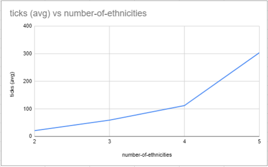
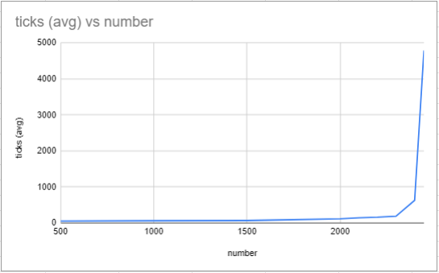
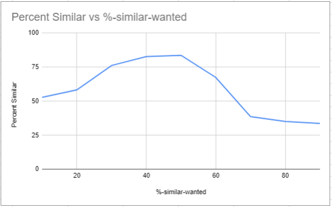

## Комп'ютерні системи імітаційного моделювання
## СПм-22-3, **Зайцев Дмитро Ярославович**
### Лабораторна робота №**1**. Опис імітаційних моделей та проведення обчислювальних експериментів

 

### Варіант 8, модель у середовищі NetLogo:
[Segregation Simple Extension 1](http://www.netlogoweb.org/launch#http://www.netlogoweb.org/assets/modelslib/IABM%20Textbook/chapter%203/Segregation%20Extensions/Segregation%20Simple%20Extension%201.nlogo)

 

### Вербальний опис моделі:
Цей проект моделює поведінку черепах різних етнічних груп у міфічному ставку. Всі черепахи ладнають між собою. Але кожна черепаха хоче переконатися, що вона живе біля когось «свого». Симуляція показує, як ці індивідуальні вподобання впливають на переміщення в ставку.

### Керуючі параметри:
- **number** Визначає кількість агентів у середовищі моделювання, тобто, в даній моделі, кількість черепашок у ставку.
- **%-similar-wanted**. Контролює відсоток одноколірних черепах, яких кожна черепаха хоче мати серед своїх сусідів. Наприклад, якщо повзунок встановлено на 30, кожна зелена черепаха хоче, щоб принаймні 30% її сусідів були зеленими черепахами.
- **number-of-ethnicities** Повзунок контролює кількість різних типів черепах, кожен тип різного кольору.

### Внутрішні параметри:
#### Глобальні
- **percent-similar**. Середній відсоток скільки сусідів черепахи такого ж кольору, як і кожна черепаха.
- **percent-unhappy**. Скільки відсотків черепах незадоволені.
- **colors**. Список кольорів, які використовуються.
#### Для кожного агента
- **happy**. Для кожної черепахи вказує, чи принаймні ***%-similar-wanted*** відсоток сусідів цієї черепахи такого ж кольору, як і ця черепаха.
- **similar-nearby**. Зберігає як багато черепах того ж кольору поряд.
- **total-nearby**. Зберігає скільки всього черепах поряд.

### Показники роботи системи:
- Середній відсоток для кожної черепахи, який означає скільки сусідів у черепахи такого ж кольору. Змінюється кожного такту.
- Відсоток незадоволених черепах (не ***happy***).

### Примітки:
При досягненні **percent-unhappy** значення 0, симуляція закінчується, бо закінчуються зміни. Кожна черепаха симуляції ***happy***.

 

## Обчислювальні експерименти
### 1. Вплив кількості етнічних груп на швидкість генерації кінцевого результату.
Досліджується залежність швидкості генерації кінцевого результату (середня кількість ***ticks***) від кількості етнічних груп (***number-of-ethnicities***).
Експерименти проводяться для всіх можливих значень кількості етнічних груп (від 2 до 5).
У якості значення часу, який знадобився для генерації результату, буде братись середнє значення ***ticks*** з 5 спроб для кожного значення ***number-of-ethnicities***.
Інші керуючі параметри:
- **number**: 900
- **%-similar-wanted**: 60%

<table>
<thead>
<tr><th>Кількість груп</th><th>Середній час результату</th></tr>
</thead>
<tbody>
<tr><td>2</td><td>21</td></tr>
<tr><td>3</td><td>59</td></tr>
<tr><td>4</td><td>112</td></tr>
<tr><td>5</td><td>304</td></tr>
</tbody>
</table>

Графік наочно показує, що від кількості етнічних груп значно залежить час на знаходження кожним агентом свого місця. Попри невелику вибірку, можна припустити, що залежність експоненційна.

### 2. Вплив кількості черепашок на швидкість генерації кінцевого результату.
Досліджується залежність швидкості генерації кінцевого результату (середня кількість ***ticks***) від кількості агентів-черепашок (***number***).
Експерименти проводяться для всіх значень ***number*** від 500 до 2000 з кроком у 500 та від 2000 до 2450 з кроком у 100 (50).
У якості значення часу, який знадобився для генерації результату, буде братись середнє значення ***ticks*** з 5 спроб для кожного значення ***number***.
Інші керуючі параметри:
- **%-similar-wanted**: 60%
- **number-of-ethnicities**: 3

<table>
<thead>
<tr><th>Кількість агентів-черепашок</th><th>Середній час результату</th></tr>
</thead>
<tbody>
<tr><td>500</td><td>54</td></tr>
<tr><td>1000</td><td>62</td></tr>
<tr><td>1500</td><td>67</td></tr>
<tr><td>2000</td><td>114</td></tr>
<tr><td>2100</td><td>141</td></tr>
<tr><td>2200</td><td>159</td></tr>
<tr><td>2300</td><td>189</td></tr>
<tr><td>2400</td><td>628</td></tr>
<tr><td>2450</td><td>4791</td></tr>
</tbody>
</table>

Графік показує, що кількість агентів-черепашок впливає на час генерації результату експоненційно. 
Можливо, це пов'язано з обмеженим простором поля, і зі збільшенню кількості агентів просто зменшується простір для маневру для кожної черепашки.

### 3. Вплив порогового значення задоволенності на швидкість прогресії задоволенності серед агентів-черепашок.
Досліджується залежність швидкості прогресії рівня задоволенності (***percent-similar***) від порогового значення задоволенності (***%-similar-wanted***).
Експерименти проводяться для значень ***%-similar-wanted*** від 10% до 100% з кроком у 10%.
Значення знімається на десятому тіку симуляції. У таблицю заноситься середнє з 5 знятих значень. 
Інші керуючі параметри:
- **number**: 1000
- **number-of-ethnicities**: 3

<table>
<thead>
<tr><th>Бажаний рівень задоволенності</th><th>Percent Similar</th></tr>
</thead>
<tbody>
<tr><td>10</td><td>52.8</td></tr>
<tr><td>20</td><td>58.3</td></tr>
<tr><td>30</td><td>76.2</td></tr>
<tr><td>40</td><td>82.8</td></tr>
<tr><td>50</td><td>83.7</td></tr>
<tr><td>60</td><td>67.4</td></tr>
<tr><td>70</td><td>38.6</td></tr>
<tr><td>80</td><td>35.1</td></tr>
<tr><td>90</td><td>33.6</td></tr>
</tbody>
</table>

На графіку видно, що до 40-50% відбувається збільшення середнього рівня задоволенності агентів-черепашок, після чого йде зменшення.
Насправді, перша (зростаюча) частина графіка така, бо симуляція встигала закінчитись до тіку, який тестувався, і фактично викорустовувалось значення при якому симуляція завершувалась.
Але далі йде поступове зменшення до рівня приблизно 30%. Це приблизно початковий рівень задоволенності при обраних параметрах. Тобто зі збільшенням ***%-similar-wanted***, значення Percent Similar все ближче і ближче наближається до початкового на десятому тіку.
